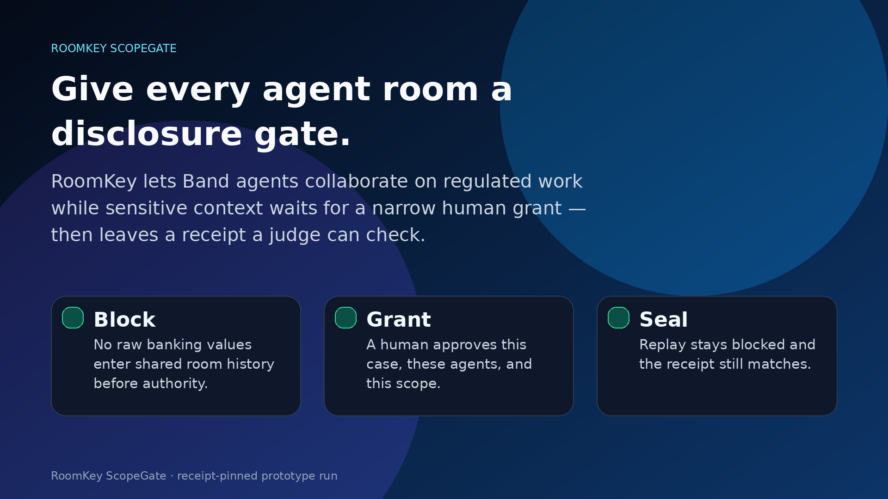

<p align="center">
  
</p>

# RoomKey ScopeGate

**RoomKey is a receipt-pinned prototype for authority-before-disclosure in Band agent rooms.**

Agent rooms make multi-agent work useful. Regulated work makes disclosure expensive. The hard problem is not getting agents to collaborate. It is proving that sensitive context moved only after someone with authority narrowed the scope.

RoomKey adds a disclosure gate to the room. Agents can ask, summarize, review, and hand off work, but protected context stays blocked until a human grant exists for this case. When the run ends, RoomKey leaves a browser-checkable receipt: what was blocked, what was approved, what was revoked, and what protected values did not appear in shared Band history in this run.

## No-video judge path

**If there is no video, start here.** This README is written so a judge can evaluate the submission without narration.

1. Open the real CLI transcript page: https://davfd.github.io/ScopeGateRoomKey/site/index.html
2. Read the transcript header: it is **actual command stdout**, not a fake button or browser animation.
3. Confirm the transcript shows these passes:
   - `PASS_RECEIPT_TIMELINE`
   - `PASS_DEMO_PROOF`
   - `PASS_ROOMKEY_PROOF`
   - `browser_site_canonical_receipt_match=PASS`
4. Scroll to the proof cards. The browser should show the public bundle, receipt contract, and receipt hash as verified.
5. If you want to reproduce the checks locally, run the commands in [Audit it yourself](#audit-it-yourself).

Submission status: `SUBMITTING_WITHOUT_VIDEO`. A video would only narrate this path. The evidence is the receipt, transcript, proof files, and tests below.

## What this is / is not

**This is not a live app.** It is a public, static, receipt-backed proof viewer for a recorded Band run plus a Python prototype and verification harness.

What exists:

- a deployed GitHub Pages evidence console;
- `site/cli-transcript.txt`, generated from real local commands;
- a canonical receipt JSON for the recorded Band run;
- Python gate / context / receipt code under `src/roomkey/`;
- local verification scripts and regression tests;
- downloadable proof artifacts for judges.

What is **not** claimed:

- not production security;
- not independent Band-side security;
- not exhaustive replay coverage;
- not production identity or access-control readiness;
- not a hosted service accepting new live user requests from the public page.

The bounded claim is narrower and testable: **this prototype run blocked disclosure before authority, released only scoped context after a human grant, recorded three reviewer deposits, revoked the grant, blocked late/post-revocation access, and sealed a receipt whose public proof path can be checked.**

## Live links

- Live evidence console: https://davfd.github.io/ScopeGateRoomKey/site/index.html
- Public repo: https://github.com/davfd/ScopeGateRoomKey
- CLI transcript: [`site/cli-transcript.txt`](site/cli-transcript.txt)
- Proof pack: [`proof/ROOMKEY_PROOF_PACK.md`](proof/ROOMKEY_PROOF_PACK.md)
- Canonical receipt: [`receipts/live-band-demo-20260618T185330Z.json`](receipts/live-band-demo-20260618T185330Z.json)
- Lablab submission packet: [`docs/LABLAB_SUBMISSION_PACKET.md`](docs/LABLAB_SUBMISSION_PACKET.md)
- Slide deck PDF: [`docs/lablab-roomkey-slide-deck.pdf`](docs/lablab-roomkey-slide-deck.pdf)
- Cover image: [`media/lablab-cover-16x9.png`](media/lablab-cover-16x9.png)

## The demo in one paragraph

A supplier asks finance to change payment instructions before a wire goes out. A requester agent, evidence agent, risk agent, reviewers, and an action/gate agent need to coordinate in a Band room. RoomKey lets them work without dumping raw banking details into shared room history. First the gate blocks the request. Then a human approves a narrow scope for this case. Agents review safe summaries, hashes, and policy excerpts. Three reviewers deposit decisions. The operator revokes access. Late replay and post-revocation access fail. The run is sealed with a receipt.

**Key insight:** a room is not a permission boundary. RoomKey makes disclosure its own event: blocked before authority, narrowed by a human grant, revoked after use, and sealed with a receipt.

## Real CLI transcript

The public page shows `site/cli-transcript.txt`, generated by [`scripts/build_cli_transcript.py`](scripts/build_cli_transcript.py). The important part: the page does not fabricate terminal output in JavaScript. It loads a committed transcript generated by running these commands:

```bash
python scripts/receipt_timeline.py receipts/live-band-demo-20260618T185330Z.json
PYTHONPATH=src python -m roomkey.cli verify receipts/live-band-demo-20260618T185330Z.json
python scripts/judge_proof.py receipts/live-band-demo-20260618T185330Z.json
python scripts/browser_verifier_contract_check.py --root .
```

Expected high-signal lines:

```text
PASS_RECEIPT_TIMELINE
03 pre-grant BLOCK action=send_wire_review reason=no scoped grant
05 human grant GRANTED grant_id=grant_0204c5961d10
10 context RELEASED key=policy_excerpt raw_posted=false
11 late replay BLOCKED participant=Unapproved Auditor recovered=false
14 reviewer DEPOSIT reviewer=ReviewerA verdict=ALLOW independent=true raw_posted=false
21 review gate ADJUDICATED outcome=HUMAN_ESCALATE reviewers=3
22 grant REVOKED grant_id=grant_0204c5961d10
23 post-revocation BLOCK action=send_wire_review reason=grant revoked
24 context BLOCKED key=policy_excerpt reason=grant revoked
25 receipt SEALED receipt_sha256=b737b1087e8af84c23e6e3a341038735511606b391641c57a056fb3f1f543925
PASS_DEMO_PROOF
PASS_ROOMKEY_PROOF
browser_receipt_hash_check=PASS
browser_site_canonical_receipt_match=PASS
```

## What a judge can verify in 90 seconds

1. **Problem:** shared agent rooms are useful, but regulated teams cannot spray protected context into room history.
2. **Mechanism:** RoomKey inserts a gate before disclosure. No grant means block. Narrow human grant means only scoped release. Revocation closes the path.
3. **Evidence:** the live page shows the actual CLI transcript for the recorded run.
4. **Proof cards:** the browser recomputes public bundle and receipt checks from public files.
5. **Boundary:** the result is a receipt-pinned prototype run, not a production security claim.

## Audit it yourself

You can audit this at four depths.

### 1. Browser check

Open the live page. The browser checks the public files every time it loads. The cards mean:

- **Public bundle is intact**: the evidence file has the use case, agents, attacks, downloads, and seal ID.
- **Receipt contract is intact**: the receipt includes Band message IDs, gate events, reviewer deposits, revocation, post-revocation blocks, and secret-scan fields.
- **Receipt hash matches**: the browser recomputes the canonical receipt hash and checks site/canonical receipt equality.

If a proof file drifts, the cards should turn red.

### 2. Read the transcript

Open [`site/cli-transcript.txt`](site/cli-transcript.txt). It should show the four commands above and their stdout. The transcript is short enough to read without running anything.

### 3. Run the local proof commands

```bash
git clone https://github.com/davfd/ScopeGateRoomKey.git
cd ScopeGateRoomKey
python -m pip install -e . pytest

python scripts/receipt_timeline.py receipts/live-band-demo-20260618T185330Z.json
PYTHONPATH=src python -m roomkey.cli verify receipts/live-band-demo-20260618T185330Z.json
python scripts/judge_proof.py receipts/live-band-demo-20260618T185330Z.json
python scripts/browser_verifier_contract_check.py --root .
```

### 4. Run the stricter submit gate

```bash
make submit-check
# if make is unavailable:
python scripts/submit_check.py
```

That runs receipt checks, integrity checks, banned-copy checks, browser verifier contract checks, and regression tests.

## How the prototype is wired

| Layer | File(s) | What to inspect |
|---|---|---|
| Gate policy | [`src/roomkey/policy.py`](src/roomkey/policy.py) | blocks actions/context without a scoped grant; checks agent, case, action kind, expiry, and revocation |
| Context release | [`src/roomkey/context_store.py`](src/roomkey/context_store.py) | releases scoped values only through the gate decision path |
| Live Band harness | [`src/roomkey/live_demo.py`](src/roomkey/live_demo.py) | posts safe metadata, hashes, event labels, and receipt evidence; does not post raw protected payload values |
| Receipt verification | [`src/roomkey/receipt.py`](src/roomkey/receipt.py) | recomputes receipt hash, checks event order, Band message IDs, reviewer deposits, secret scan, and revocation evidence |
| CLI | [`src/roomkey/cli.py`](src/roomkey/cli.py) | exposes `verify`, local demo, and live Band demo entrypoints |
| Browser proof | [`site/verifier.js`](site/verifier.js) | fetches public evidence/receipt files, recomputes hashes, and renders proof cards |
| Real transcript builder | [`scripts/build_cli_transcript.py`](scripts/build_cli_transcript.py) | runs the proof commands and writes `site/cli-transcript.txt` |

## Receipt facts for this run

| Fact | Value |
|---|---:|
| Mode | `live_band_spear` |
| Band messages | `25` |
| Live gate events | `25` |
| Context releases | `4` |
| Reviewer deposits | `3` |
| Post-revocation blocks | `2` |
| Raw secret canary posted | `false` |
| Protected payload value posted | `false` |
| Late replay recovered context | `false` |
| Receipt SHA-256 | `b737b1087e8af84c23e6e3a341038735511606b391641c57a056fb3f1f543925` |

## Raw verifier lines, decoded

| Raw line | Plain English |
|---|---|
| `winning_frame=Give every agent room a disclosure gate.` | The page thesis. Useful for orientation, not a proof by itself. |
| `canonical_receipt_sha256=b737...` | The fingerprint of the receipt content the page claims as canonical. |
| `browser_receipt_hash=b737...` | What your browser computed from the receipt. It should match the canonical hash. |
| `live_receipt_file_sha256=f6d2...` | The fingerprint of the receipt file shipped with the site. |
| `browser_receipt_file_hash=f6d2...` | What your browser computed from that file. It should match the shipped-file hash. |
| `browser_site_canonical_receipt_match=PASS` | The site copy and canonical copy of the receipt are byte-identical. |
| `raw_secret_canary_posted=false` | The secret canary was not found in shared Band room history in this run. |
| `protected_payload_value_posted=false` | The protected payload value was not posted in shared Band room history in this run. |
| `late_replay_recovered=false` | A late replay attempt did not recover protected context. |
| `browser_*_check=PASS` | The browser checked evidence structure, receipt structure, receipt hash, receipt file hash, and site/canonical receipt equality. |

The short version: your browser checks that the receipt is the same receipt, the public proof bundle still matches, protected values were not posted in this run, and replay stayed blocked. You do not have to trust the page copy.

## How it maps to the Band challenge

| Criterion | RoomKey evidence |
|---|---|
| 3+ agents collaborate through Band | Requester, evidence/risk/action, three reviewers, and audit/gate roles are bound to Band message IDs in the receipt. |
| Band is the collaboration layer | The receipt records Band message IDs for room posts, reviewer deposits, grant state, revocation, and seal. |
| Shared context / handoff / state | Agents see safe labels, hashes, summaries, decisions, and gate state before raw context can move. |
| Agent API use | The prototype posts through the official Band Agent API and records returned message IDs/status for this run. |
| Business value | Finance, healthcare, legal, compliance, procurement, and incident rooms can collaborate with a narrower disclosure path. |
| Originality | RoomKey turns authority-before-disclosure into a visible room primitive: block, grant, scoped release, revoke, seal. |

## Downloadable proof

- [`proof/ROOMKEY_PROOF_PACK.md`](proof/ROOMKEY_PROOF_PACK.md): short judge-readable proof path.
- [`proof/ATTACK_MATRIX.json`](proof/ATTACK_MATRIX.json): machine-readable attack survival matrix.
- [`proof/USE_CASE_VENDOR_WIRE_APPROVAL.md`](proof/USE_CASE_VENDOR_WIRE_APPROVAL.md): concrete operator use case.
- [`proof/TEXT_INJECTION_MUTATION_RECEIPT.md`](proof/TEXT_INJECTION_MUTATION_RECEIPT.md): prompt-like text stayed inert.
- [`receipts/live-band-demo-20260618T185330Z.json`](receipts/live-band-demo-20260618T185330Z.json): canonical receipt.
- [`site/evidence.json`](site/evidence.json): public evidence manifest.
- [`docs/PUBLIC_SUBMIT_SEAL.md`](docs/PUBLIC_SUBMIT_SEAL.md): deploy/readback seal.

## Council / reviewer audit checklist

For a final submission audit, reviewers should check:

1. Does the README make sense without a video?
2. Does the live page show a real CLI transcript rather than a fake run button?
3. Do the CLI transcript, proof pack, receipt JSON, and browser verifier agree on the same receipt hash?
4. Are protected payload values absent from shared Band history in this run?
5. Are public claims bounded to a receipt-pinned prototype run?
6. Are there any broken links, stale video claims, private values, credentials, or production-security overclaims?

Return `ROOMKEY_SUBMISSION_PASS` only if all six are acceptable. Return `ROOMKEY_SUBMISSION_BLOCK` with file/line evidence if any current submission blocker remains.

## Claim boundary

Say: RoomKey proves a receipt-pinned prototype run of authority-before-disclosure in a Band room. The receipt and integrity gates show protected payload values were not posted to Band in this run.

Do not say: this proves production security, independent Band-side security, exhaustive replay protection, or production identity guarantees.
